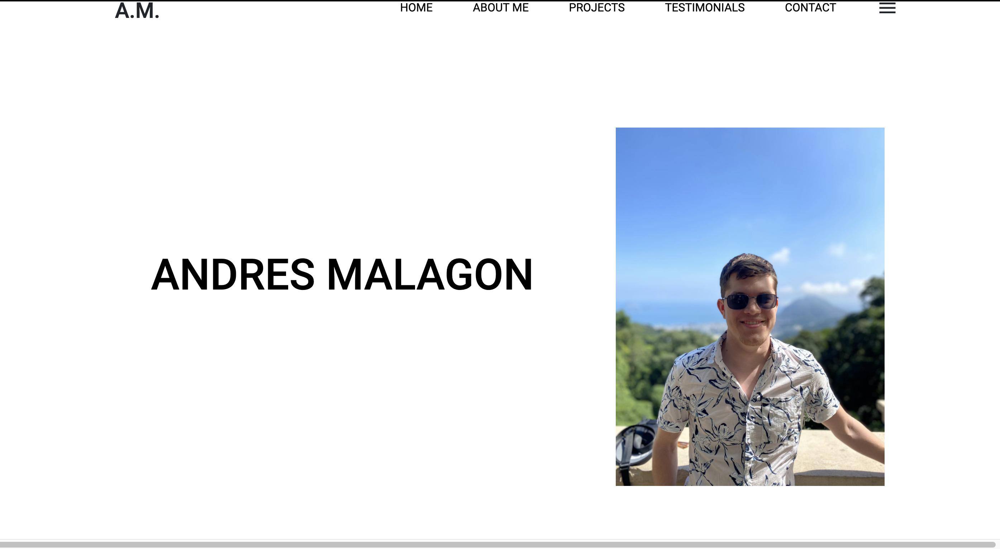

# REACT Portfolio
  
## Description

This is my portfolio created with React.js. It includes an about me section, a projects section,  a testimonials section, and a contact section.

## Table of Contents

* [Installation](#installation)
 * [Usage](#usage)
 
 * [Tests](#tests)
 * [Questions](#questions)

## Installation Instructions

run npm install then npm start. The website should open in localhost:3000

## Usage

No instructions required

## Tests

Testing has not been applied

## License

This application is licensed under MIT

## Questions

If you have any questions, email me at amalagon251@gmail.com

Github: github.com/amalagon1
